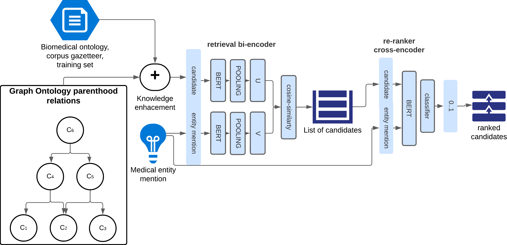

# Clinical Entity Linking in Spanish with Knowledge-Graph Enhanced Biencoders

Welcome to the official repository of the ClinLinker-KB, developed by the Computational Intelligence and Biomedicine (ICB) group at the University of Málaga and Barcelona Super Computing Center (BSC). 




## Environment main settings

- Python 3.10+
- PyTorch 2.1.0

## Installation

Clone the repository and install the required packages:

```bash
git clone https://github.com/ICB-UMA/ClinLinker-KB.git
```

### Requirements

```bash
cd ClinLinker-KB
pip install -r requirements
```

## Usage

The repository includes scripts for data generation and model training. Here are examples of how to use these scripts:

### Data Generation

Create your own data from:


```bash
generate_pretraining_data.ipynb
```


### Train your cross-encoder

```bash
cd scripts/
python cross_encoder_training.py 

```

## Features

- **Multilingual Support:** Capable of processing and understanding multiple languages.
- **Advanced Machine Learning Techniques:** Utilizes state-of-the-art models and frameworks.
- **High-Performance Computing:** Initially deployed and tested on an NVIDIA RTX 2080 Ti GPU, though not a mandatory requirement.

## Contributing

We welcome contributions from the community. Please submit your pull requests to the `main` branch and ensure your code adheres to the existing style.


